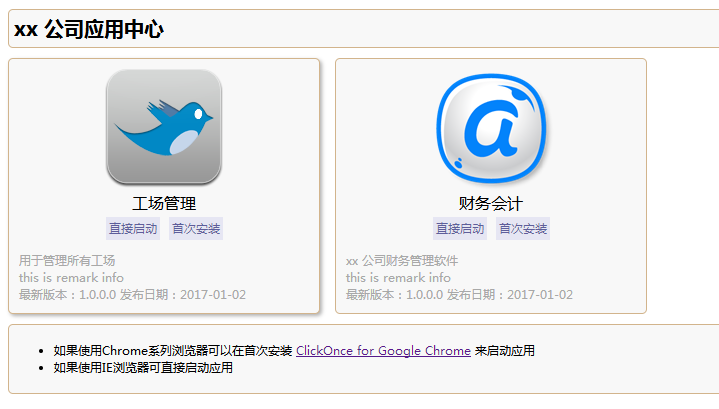

## ClickOnce Html Template（ClickOnce 发布页面 HTML 模板）
* 用途：定制 VisualStuido 自动生成ClickOnce的HTML模板页

## 使用
1. 配置config.json中相应的信息
2. index.html 自由修改想要的样式或者使用默认

## config.json 说明
```javascript
{
    "title": "app store title",
    "apps": [{
        "name": "appname",
        "description": "app descriptions",
        "version": "1.0.0.0",
        "runUrl": "app/app.application",
        "stepUrl": "app/setup.exe",
        "iconUrl": "assets/icons/app1.png",
        "remark": "this is remark info",
        "publishDate": "2017-01-02"
    }]
}
```

## Todo List (待办项)
- [x] 实现模板页
- [x] 模板数据提取出单独的配置文件config.json
- [ ] 实现自动生成config.json中的信息

## default template (默认模板)
