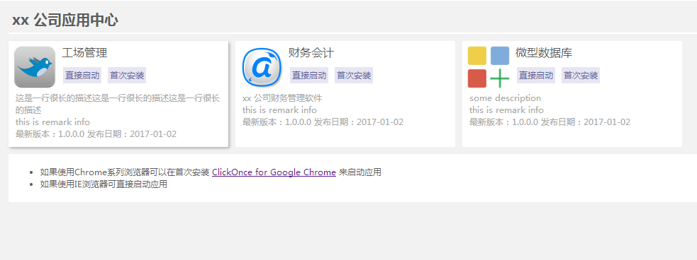
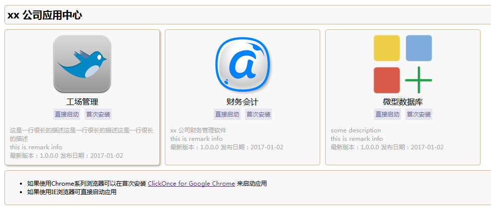

## ClickOnce Html Template（ClickOnce 发布页面 HTML 模板）
* 用途：定制 VisualStuido 自动生成ClickOnce的HTML模板页
* 查看 [Demo](https://tigeryzx.github.io/ClickOnceHtmlTpl/index.html)

## 使用
1. 配置config.json中相应的信息
2. index.html 自由修改想要的样式或者使用默认
3. 把目录中的 assets文件夹、updateTool文件夹、index.html复制到ClickOnce的发布目录中

## config.json 说明
```javascript
{
    "title": "app store title",
    "apps": [{
        "deployassemblyId": "*.application",
        "name": "appname",
        "description": "app descriptions",
        "version": "1.0.0.0",
        "runUrl": "app/app.application",
        "stepUrl": "app/setup.exe",
        "iconUrl": "assets/icons/app1.png",
        "remark": "this is remark info",
        "publishDate": "2017-01-02 10:20:30"
    }]
}
```
> 其中 `deployassemblyId` 来自于发布后的ClickOnce目录中的 *.application 文件中的节点 `asmv1:assembly\assemblyIdentity` 的name属性值，用于更新配置时进行对比

## config update tool (配置更新工具)

> 用于发布新版本后自动更新config.json中的版本号与发布日期信息，工具基于.Net Core 2.1构建

1. 配置`setting.json`文件中关联的*.application路径信息

```javascript
{
  "applicationPaths": [
    "../../app1/app1.application",
    "../../app2/app2.application"
  ]
}
```
2. 执行更新配置命令`dotnet GConfig.dll`

```c#
cd updateTool
// 以下两条命令效果一样，任意执行一行即可更新
dotnet GConfig.dll
dotnet GConfig.dll -c ../assets/config.json -s ./setting.json
// 帮助
dotnet GConfig.dll --help
```

## Todo list (待办项)
- [x] 实现模板页
- [x] 模板数据提取出单独的配置文件config.json
- [x] 实现自动更新config.json中的版本及发布日期信息

## default template (默认模板)





